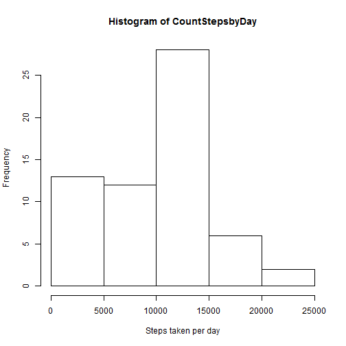
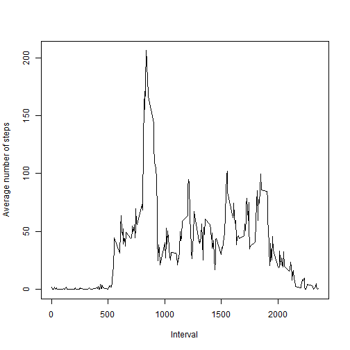

# Reproducible Research: Peer Assessment 1


## Loading and preprocessing the data
First, we unzip the data and read into the R program.

```r
unzip("activity.zip", files = "activity.csv")
data<-read.csv('activity.csv')
```

Now, we transform the date into the date format from factor


```r
data$date<-as.Date(as.character(data$date))
```
## What is mean total number of steps taken per day?
We count the number of steps taken on each date. To do this, we split the steps column using the split function. Then we apply the sum function recursively over all the dates using the lapply function. The result needs to be converted to the numeric format so histogram can be drawn.


```r
CountStepsbyDay<-lapply(split(data$steps,factor(data$date)),sum, na.rm=TRUE)
CountStepsbyDay<-as.numeric(CountStepsbyDay)
hist(CountStepsbyDay,xlab="Steps taken per day")
```

 

The mean of the number of steps taken per day is 9354.2295 and the median is 1.0395 &times; 10<sup>4</sup> as can be obtained using the commands below.


```r
mean(CountStepsbyDay)
```

```
## [1] 9354
```

```r
median(CountStepsbyDay)
```

```
## [1] 10395
```


## What is the average daily activity pattern?
To investigate the average daily activity pattern, we can first split the steps by intervals. Then we can recursively apply mean function using lapply. Finally we can plot the average number of steps taken in each interval as below.

```r
stepsPerInterval<-split(data$steps,factor(data$interval))
avgStepsPerInterval<-lapply(stepsPerInterval,mean,na.rm=TRUE)
plot(as.numeric(levels(factor(data$interval))),as.numeric(avgStepsPerInterval),type="l",xlab="Interval",ylab="Average number of steps")
```

 
## Imputing missing values

The total number of missing values in the data are 2304 found using the command.

```r
length(data$date)-sum(complete.cases(data))
```

```
## [1] 2304
```
A reasonable strategy to fill in the missing values in the number of steps is to fill it with average number of steps taken in that day. The average number of steps taken in a day is calucalted by counting number of steps taken in a day and dividing it by 288 (24hours a day *12 five minute intervals per hour).

```r
index<-!complete.cases(data)
#index has TRUE whenever there is a NA values in data$steps
CountStepsbyDay<-lapply(split(data$steps,factor(data$date)),sum, na.rm=TRUE)
Dates<-data$date[index] #dates at which NA values occurs
substituteValues<-as.numeric(CountStepsbyDay[as.character(Dates)])/288
# This is a 2304 length vecto
data1<-data
data1$steps[index]<-substituteValues
#data1 is the new data.
```
We can repeat the process on data1 to recreate the histogram with data1

```r
CountStepsbyDay<-lapply(split(data1$steps,factor(data1$date)),sum, na.rm=TRUE)
CountStepsbyDay<-as.numeric(CountStepsbyDay)
hist(CountStepsbyDay,xlab="Steps taken per day")
```

 
The new mean and the median are 9354.2295 and 1.0395 &times; 10<sup>4</sup> which are not much different from the values before.

```r
mean(CountStepsbyDay)
```

```
## [1] 9354
```

```r
median(CountStepsbyDay)
```

```
## [1] 10395
```
## Are there differences in activity patterns between weekdays and weekends?

